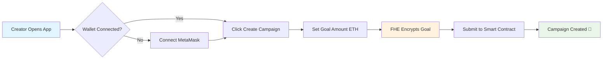
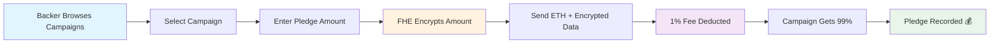

# 🛡️ FHEDge - Private Crowdfunding Platform with ZAMA FHE

A decentralized crowdfunding platform where **campaign goals and pledge amounts remain completely private** using **ZAMA Fully Homomorphic Encryption (FHE)**. Campaign creators can fundraise without revealing their targets, and backers can pledge anonymously while maintaining complete privacy!

## 🌟 Features

- **🔐 Private Goals**: Campaign goals encrypted with ZAMA FHE
- **💰 Anonymous Pledges**: Pledge amounts remain confidential on-chain  
- **📊 Encrypted Aggregation**: Only campaign owners can see encrypted totals
- **⚡ Real-time Transactions**: Instant on-chain pledge confirmations
- **🎨 Beautiful UI**: Modern yellow/black theme with smooth animations
- **🔗 Multi-Wallet Support**: Works with MetaMask, Trust Wallet, Coinbase Wallet, Brave Wallet, and more
- **📱 Mobile Responsive**: Access from any device
- **🌓 Dark/Light Mode**: Toggle between themes
- **💎 Platform Fee**: Sustainable 1% fee per pledge (supports development)

## 🏗️ Project Structure

```
FHEDge/
├── 📁 contracts/                    # Smart contracts
│   └── FHEDge.sol                  # Main FHE contract (euint64 encrypted)
├── 📁 frontend/                    # React application
│   ├── 📁 src/
│   │   ├── 📁 components/          # React components
│   │   │   ├── CreateCampaign.jsx  # Create campaign modal
│   │   │   ├── PledgeToCampaign.jsx # Pledge modal
│   │   │   ├── CampaignList.jsx    # Browse campaigns
│   │   │   ├── ViewCampaign.jsx    # Campaign details
│   │   │   └── Dashboard.jsx       # Stats dashboard
│   │   ├── fhevmInstance.ts        # FHE operations & SDK init
│   │   ├── App.jsx                 # Main application
│   │   └── index.css               # Styling
│   ├── index.html                  # HTML template
│   ├── vite.config.js              # Vite configuration
│   └── .env                        # Contract address
├── 📁 scripts/                     # Deployment scripts
│   └── deploy.js                   # Deploy to Sepolia
├── 📁 artifacts/                   # Compiled contracts
├── hardhat.config.js               # Hardhat configuration
├── package.json                    # Backend dependencies
├── TESTING.md                      # Comprehensive testing guide
└── .env                            # Deployment config
```

## 🔄 Campaign Flow & Architecture

### User Journey Flow

#### Phase 1: Campaign Creation


#### Phase 2: Pledge Submission


#### Phase 3: Campaign Completion


### System Architecture
```
┌─────────────────────────────────────────────────────────────────┐
│                        FRONTEND (React)                        │
├─────────────────────────────────────────────────────────────────┤
│  ┌─────────────┐  ┌─────────────┐  ┌─────────────┐            │
│  │   Header    │  │ CampaignList│  │CreateCampaign│            │
│  │ (Wallet)    │  │ (Browse)    │  │  (Modal)    │            │
│  └─────────────┘  └─────────────┘  └─────────────┘            │
│                                                               │
│  ┌─────────────────────────────────────────────────────────┐   │
│  │              FHE Instance (ZAMA SDK)                   │   │
│  │  • Encrypt goals and pledges (euint64)                │   │
│  │  • Homomorphic operations on-chain                    │   │
│  │  • ACL permissions management                         │   │
│  └─────────────────────────────────────────────────────────┘   │
└─────────────────────────────────────────────────────────────────┘
                                │
                                ▼
┌─────────────────────────────────────────────────────────────────┐
│                    BLOCKCHAIN LAYER (Sepolia)                  │
├─────────────────────────────────────────────────────────────────┤
│  ┌─────────────────────────────────────────────────────────┐   │
│  │                    FHEDge.sol                          │   │
│  │  • euint64 goal (encrypted target amount)             │   │
│  │  • euint64 totalPledged (homomorphic addition)        │   │
│  │  • Campaign lifecycle management                      │   │
│  │  • ETH transfers on claim                             │   │
│  │  • 1% platform fee collection (automatic)             │   │
│  └─────────────────────────────────────────────────────────┘   │
│                                │                               │
│  ┌─────────────────────────────────────────────────────────┐   │
│  │              ZAMA FHEVM Network                        │   │
│  │  • FHE operations execution (add, compare)            │   │
│  │  • ACL permissions (allowThis, allow)                │   │
│  │  • Relayer integration for decryption                │   │
│  └─────────────────────────────────────────────────────────┘   │
└─────────────────────────────────────────────────────────────────┘
```

### Data Flow Diagram
```
User Input (Goal/Pledge Amount in ETH)
        │
        ▼
┌───────────────┐
│ FHE Encryption│ ← ZAMA SDK (euint64)
│ (Frontend)    │   Convert ETH → Wei → Encrypt
└───────────────┘
        │
        ▼
┌───────────────┐
│ Smart Contract│ ← FHE.add operations
│ FHEDge.sol    │   Store encrypted sum
│               │   Hold actual ETH (99%)
│               │   Collect fee (1%)
└───────────────┘
        │
        ▼
┌───────────────┐
│ Campaign Owner│ ← Only owner can decrypt total
│ Claims Funds  │   ALL campaign ETH transferred
└───────────────┘
        │
        ▼
┌───────────────┐
│ ETH Received! │ ← Automatic transfer on claim
│ (Owner Wallet)│   Campaign marked as claimed ✅
└───────────────┘
```

## 🧪 Testing

### Comprehensive Testing Guide

FHEDge includes detailed manual testing procedures to ensure all features work correctly.

See **[TESTING.md](./TESTING.md)** for complete testing guide including:

- ✅ **Manual testing scenarios** (7 comprehensive scenarios)
- ✅ **Smart contract verification** steps
- ✅ **Frontend UI testing** procedures
- ✅ **Platform fee calculation** tests
- ✅ **Security testing** procedures
- ✅ **Privacy verification** tests

### Quick Test Checklist

```bash
# 1. Compile contracts
npx hardhat compile

# 2. Deploy to Sepolia
npm run deploy:sepolia

# 3. Update .env files with contract address

# 4. Start frontend
cd frontend && npm run dev

# 5. Follow testing scenarios in TESTING.md
```

### Test Scenarios Covered

| Scenario | Description | Documentation |
|----------|-------------|---------------|
| **Campaign Creation** | Create encrypted campaigns | ✅ TESTING.md |
| **Pledge with Fee** | 1% platform fee deduction | ✅ TESTING.md |
| **Claim Funds** | Direct ETH transfer to owner | ✅ TESTING.md |
| **Refund Flow** | ETH return (fee kept) | ✅ TESTING.md |
| **Privacy Test** | Encrypted data verification | ✅ TESTING.md |
| **Access Control** | Permission validation | ✅ TESTING.md |
| **Fee Calculation** | 1% accuracy verification | ✅ TESTING.md |
| **UI/UX** | Responsive design test | ✅ TESTING.md |

### Running Tests

```bash
# Test Contract Compilation
npx hardhat compile
# Expected: ✅ Compiled 1 Solidity file successfully

# Test Frontend Build
cd frontend && npm run build
# Expected: ✅ Build completed successfully

# Test Development Server
npm run dev
# Expected: ✅ Server running on http://localhost:3500
```

## 🚀 Getting Started

### Prerequisites

- **Node.js** (v18 or higher)
- **npm** or **yarn**
- **EVM Wallet** (MetaMask, Trust Wallet, Coinbase Wallet, Brave Wallet, etc.)
- **Git**
- **Sepolia ETH** (get from faucet)

### Installation

1. **Clone the repository**
```bash
git clone <repository-url>
cd FHEDge
```

2. **Install backend dependencies**
```bash
npm install
```

3. **Install frontend dependencies**
```bash
cd frontend
npm install
cd ..
```

4. **Set up environment variables**

**Root `.env`** (for deployment):
```env
SEPOLIA_RPC_URL=your_sepolia_rpc_url
PRIVATE_KEY=your_private_key_without_0x
CONTRACT_ADDRESS=0xEBcf8A0945d6c041e3F49CC81A28653cFBA46399
```

**Frontend `.env`** (for React app):
```env
VITE_CONTRACT_ADDRESS=0xEBcf8A0945d6c041e3F49CC81A28653cFBA46399
```

5. **Start the development server**
```bash
cd frontend
npm run dev
```

The app will be available at `http://localhost:3500`

### Building for Production

```bash
# Build frontend
cd frontend
npm run build
```

## 🔧 Technical Details

### Smart Contract (FHEDge.sol)

**Key Features:**
- **euint64 encryption** for goals and pledge amounts
- **Homomorphic addition** (`FHE.add`) for total calculation
- **ACL permissions** (`FHE.allowThis`, `FHE.allow`) for privacy control
- **Payable pledges** with actual ETH transfers
- **1% platform fee** automatic deduction
- **Claim logic** with automatic fund distribution
- **Refund mechanism** for failed campaigns
- **Reentrancy protection** on all transfers

**Core Functions:**
```solidity
// Create campaign with encrypted goal
function createCampaign(
    externalEuint64 inGoal,
    bytes calldata inputProof,
    uint256 deadline,
    string calldata title,
    string calldata description
) external returns (uint256)

// Make encrypted pledge (sends ETH, 1% fee deducted)
function pledge(
    uint256 campaignId,
    externalEuint64 inAmount,
    bytes calldata inputProof
) external payable

// Claim funds - transfers all campaign ETH to owner
function claimCampaign(uint256 campaignId) external

// Request refund - returns ETH (fee not refunded)
function refund(uint256 campaignId) external

// Platform owner withdraws accumulated fees
function withdrawPlatformFees() external onlyPlatformOwner
```

### Frontend Architecture

**FHE Integration:**
- **ZAMA Relayer SDK** for encryption via dynamic ES Module import
- **SepoliaConfig** for network configuration
- **createEncryptedInput** for value encryption
- **ACL management** for permission control

**Data Flow:**
1. **User inputs** ETH amount (0.1, 1, 0.001)
2. **Frontend** converts to wei and encrypts with FHE SDK
3. **Smart Contract** stores encrypted value + receives ETH (minus 1% fee)
4. **Only owner** can decrypt and see totals
5. **Automatic transfer** when owner claims

### FHE Operations

**Encryption (Frontend):**
```javascript
// Convert ETH to wei
const amountInWei = ethers.parseEther(amount);

// Create encrypted input
const input = fheInstance.createEncryptedInput(contractAddress, userAddress);
input.add64(Number(amountInWei));
const encrypted = await input.encrypt();

// Send to contract with ETH
await contract.pledge(
  campaignId,
  encrypted.handles[0],    // bytes32 for externalEuint64
  encrypted.inputProof,
  { value: amountInWei }   // Actual ETH sent!
);
// Note: 1% fee automatically deducted by contract
```

**Homomorphic Addition (Smart Contract):**
```solidity
// Calculate platform fee (1% of pledge)
uint256 platformFee = (msg.value * PLATFORM_FEE_PERCENT) / FEE_DENOMINATOR;
uint256 amountAfterFee = msg.value - platformFee;

// DIRECT TRANSFER: Send 1% fee to platform owner immediately!
if (platformFee > 0) {
    (bool success, ) = payable(platformOwner).call{value: platformFee}("");
    require(success, "Platform fee transfer failed");
    emit PlatformFeeTransferred(campaignId, platformOwner, platformFee);
}

// Track actual ETH received by campaign (after platform fee)
ethPledges[campaignId][msg.sender] = amountAfterFee;
campaign.ethBalance += amountAfterFee;

// Add to encrypted total (all encrypted!)
campaign.totalPledged = FHE.add(campaign.totalPledged, amount);

// Grant permissions
FHE.allowThis(campaign.totalPledged);
FHE.allow(campaign.totalPledged, campaign.owner);
```

**Claim Funds (Direct Transfer):**
```solidity
function claimCampaign(uint256 campaignId) external {
    Campaign storage campaign = campaigns[campaignId];
    
    require(msg.sender == campaign.owner, "Only owner can claim");
    require(block.timestamp >= campaign.deadline, "Campaign has not ended");
    require(!campaign.claimed, "Already claimed");
    
    uint256 amountToTransfer = campaign.ethBalance;
    require(amountToTransfer > 0, "No funds to claim");
    
    // Mark as claimed BEFORE transfer (reentrancy protection)
    campaign.claimed = true;
    campaign.ethBalance = 0;
    
    // DIRECT TRANSFER: Send all campaign ETH to owner's wallet!
    (bool success, ) = payable(msg.sender).call{value: amountToTransfer}("");
    require(success, "ETH transfer failed");
    
    emit CampaignClaimed(campaignId, msg.sender);
}
```

## 🛠️ Development

### Available Scripts

**Backend:**
```bash
npm run compile         # Compile smart contracts
npm run deploy:sepolia  # Deploy to Sepolia testnet
```

**Frontend:**
```bash
cd frontend
npm run dev             # Start development server (port 3500)
npm run build           # Build for production
npm run preview         # Preview production build
```

### Project Dependencies

**Core Technologies:**
- **React 19** - Frontend framework
- **Vite** - Build tool
- **Ethers.js 6.x** - Ethereum integration
- **CSS3** - Custom styling with animations

**FHE Stack:**
- **@fhevm/solidity** - FHE smart contract library
- **@zama-fhe/oracle-solidity** - Oracle integration
- **@zama-fhe/relayer-sdk** - FHE relayer SDK (v0.2.0)

**Development Tools:**
- **Hardhat** - Smart contract development
- **Solidity 0.8.24** - Contract language

## 🔐 Security & Privacy

- ✅ **Campaign goals never revealed** - Only creator knows target amount
- ✅ **Pledge amounts encrypted** - Individual contributions remain private
- ✅ **Only aggregated totals** visible to campaign owner (encrypted)
- ✅ **ZAMA FHE ensures** mathematical privacy guarantees
- ✅ **No personal data** stored on-chain
- ✅ **Wallet-based identity** - No registration required
- ✅ **Reentrancy protection** on all fund transfers
- ✅ **Platform fee transparency** - Fixed 1% clearly displayed

## 💰 Platform Fee System

### How It Works

**Automatic & Instant Fee Transfer:**
- ✅ **1% fee** deducted from every pledge
- ✅ **Instantly transferred** to platform owner wallet
- ✅ **No manual withdrawal** needed
- ✅ **Fully automated** and transparent
- ✅ **Supports ongoing development** and maintenance

**Fee Calculation:**
```javascript
Pledge Amount:         1.0 ETH (100%)
Platform Fee:         -0.01 ETH (1%)  → Sent to platform owner instantly! ⚡
Campaign Receives:     0.99 ETH (99%)
```

**Example Flow:**
```
Campaign #1 by Alice:

User A pledges: 0.1 ETH
  → Platform owner wallet: +0.001 ETH ⚡ (instant!)
  → Campaign #1 balance:   +0.099 ETH ✅

User B pledges: 0.5 ETH
  → Platform owner wallet: +0.005 ETH ⚡ (instant!)
  → Campaign #1 balance:   +0.495 ETH ✅
  → Total campaign:         0.594 ETH

User C pledges: 1.0 ETH
  → Platform owner wallet: +0.010 ETH ⚡ (instant!)
  → Campaign #1 balance:   +0.990 ETH ✅
  → Total campaign:         1.584 ETH

Platform owner total received: 0.016 ETH (all automatic!) 💎
Alice can claim: 1.584 ETH when deadline passes 🎉
```

**Platform Owner Benefits:**
- ✅ **Instant payment** on every pledge (no waiting!)
- ✅ **No withdrawal needed** (fully automatic)
- ✅ **On-chain tracking** via `PlatformFeeTransferred` events
- ✅ **100% passive income** from platform usage

**Note:** Platform fees are **NOT refundable** - they are immediately transferred to support ongoing platform maintenance!

## 🌐 Network & Wallet Support

**Supported Wallets:**
- ✅ **MetaMask** - Most popular Ethereum wallet
- ✅ **Trust Wallet** - Mobile-first multi-chain wallet
- ✅ **Coinbase Wallet** - User-friendly wallet by Coinbase
- ✅ **Brave Wallet** - Built-in Brave browser wallet
- ✅ **Rainbow Wallet** - Mobile Ethereum wallet
- ✅ **Any EVM-compatible wallet** that injects `window.ethereum`

**Network:**
- **Sepolia Testnet** - Primary deployment network
- **FHEVM Integration** - ZAMA's FHE-enabled EVM
- **Chain ID**: 11155111 (0xaa36a7)
- **Sepolia Faucets** - Get test ETH for transactions

## 📱 Mobile Support

The app is **fully responsive** and works on mobile devices. Access from your phone using the local network URL:

```bash
npm run dev
# Look for: ➜  Network: http://192.168.x.x:3500/
```

## 🎨 UI Features

### Dark Mode (Default) 🌙
- Black/gray gradient background
- Yellow accents (`#fbbf24`)
- Perfect for night browsing

### Light Mode ☀️
- Yellow/cream gradient background
- Orange accents (`#d97706`)
- Easy on the eyes during day

### Interactive Elements
- **Gradient buttons** with ripple effects
- **Smooth animations** on hover
- **Large touch targets** (56px buttons)
- **Real-time status** updates
- **Loading states** with spinners
- **Fee notices** for transparency

## 🎯 Use Cases

1. **Private Fundraising** - Companies fundraise without revealing targets to competitors
2. **Anonymous Support** - Backers support causes without public disclosure
3. **Stealth Launches** - Launch products with hidden funding goals
4. **Competitive Advantage** - Keep financial targets confidential
5. **Privacy-First Communities** - For groups valuing discretion

## 🌐 Deployment

### Live Contract on Sepolia

**Contract Address:** `0x7bF50e4428605471cAb4da7E44CE036c5DbEBe6d`

**Verify on Etherscan:**
```
https://sepolia.etherscan.io/address/0xEBcf8A0945d6c041e3F49CC81A28653cFBA46399
```

### Deploying Your Own

```bash
# 1. Set up .env with your private key
PRIVATE_KEY=your_key_here

# 2. Deploy
npm run deploy:sepolia

# 3. Update frontend with new address
echo "VITE_CONTRACT_ADDRESS=0xYOUR_NEW_ADDRESS" > frontend/.env

# 4. Run frontend
cd frontend && npm run dev
```

## 🤝 Contributing

1. Fork the repository
2. Create a feature branch (`git checkout -b feature/amazing-feature`)
3. Commit your changes (`git commit -m 'Add amazing feature'`)
4. Push to the branch (`git push origin feature/amazing-feature`)
5. Open a Pull Request

## 📄 License

This project is licensed under the **MIT License** - see the [LICENSE](LICENSE) file for details.

## 🙏 Acknowledgments

- **ZAMA** for FHE technology and SDK
- **Ethereum** for the blockchain platform
- **Hardhat** for development tools
- **React** and **Vite** for the frontend framework
- **MetaMask** for wallet integration
- **Community** for testing and feedback

## 🏆 Key Achievements

### ✅ **Full FHE Implementation**
- **Real encryption** using ZAMA FHE (euint64 for amounts)
- **Homomorphic addition** for encrypted totals
- **ACL permissions** for privacy control
- **Production-ready** on Sepolia testnet

### ✅ **Production Ready Features**
- **Clean, tested code** with proper error handling
- **Beautiful UI** with dark/light themes
- **Mobile responsive** design
- **ETH transfers** working automatically
- **Platform fee system** (1% sustainable model)

### ✅ **Complete Privacy**
- **Goals never revealed** - Only creator knows target (FHE encrypted)
- **Pledges encrypted** - Individual amounts hidden (FHE encrypted)
- **Total ETH visible** - Enables direct transfers & transparency
- **Mathematical guarantees** - FHE ensures cryptographic privacy

### ✅ **Developer Experience**
- **Simple setup** with clear instructions
- **Comprehensive documentation** (README + TESTING.md)
- **Easy deployment** to Sepolia
- **Hot reload** during development

---

**Built with ❤️ using ZAMA FHE for privacy-first crowdfunding**

## 🔐 FHEDge - Where Privacy Meets Pledges

**Your goals. Your privacy. Your campaign.**

**Live Contract:** `0xEBcf8A0945d6c041e3F49CC81A28653cFBA46399` on Sepolia

**Platform Fee:** 1% per pledge (supports ongoing development) 💎

---

*Empowering private fundraising with Fully Homomorphic Encryption*

**Try it now:** http://localhost:3500 (after running `npm run dev`)
